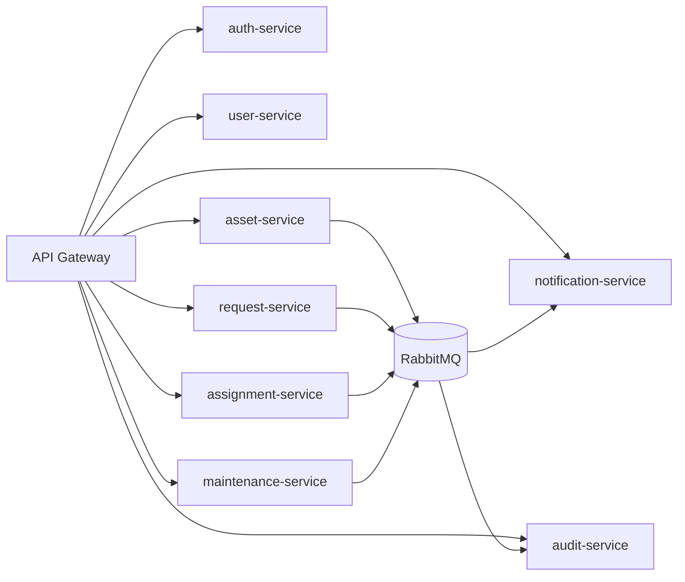
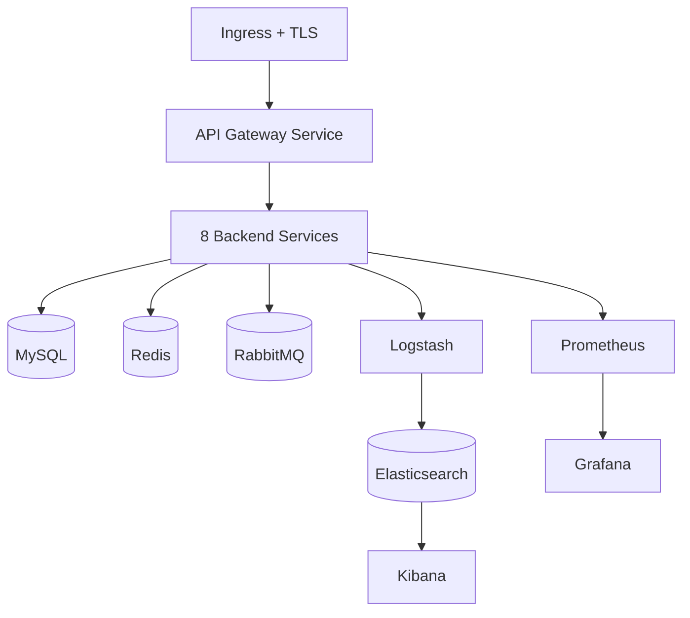

# LAMS Architecture

## Microservices Diagram

```mermaid
flowchart LR
  GW[API Gateway] --> AUTH[auth-service]
  GW --> USER[user-service]
  GW --> ASSET[asset-service]
  GW --> REQ[request-service]
  GW --> ASSIGN[assignment-service]
  GW --> MAINT[maintenance-service]
  GW --> NOTIF[notification-service]
  GW --> AUDIT[audit-service]
  ASSET --> MQ[(RabbitMQ)]
  REQ --> MQ
  ASSIGN --> MQ
  MAINT --> MQ
  MQ --> NOTIF
  MQ --> AUDIT
```

## Kubernetes Deployment Diagram

```mermaid
flowchart TD
  INGRESS[Ingress + TLS] --> GW[API Gateway Service]
  GW --> SVC[8 Backend Services]
  SVC --> MYSQL[(MySQL)]
  SVC --> REDIS[(Redis)]
  SVC --> RABBIT[(RabbitMQ)]
  SVC --> PROM[Prometheus]
  SVC --> LOG[Logstash]
  LOG --> ES[(Elasticsearch)]
  ES --> KIB[Kibana]
  PROM --> GRAF[Grafana]
```
