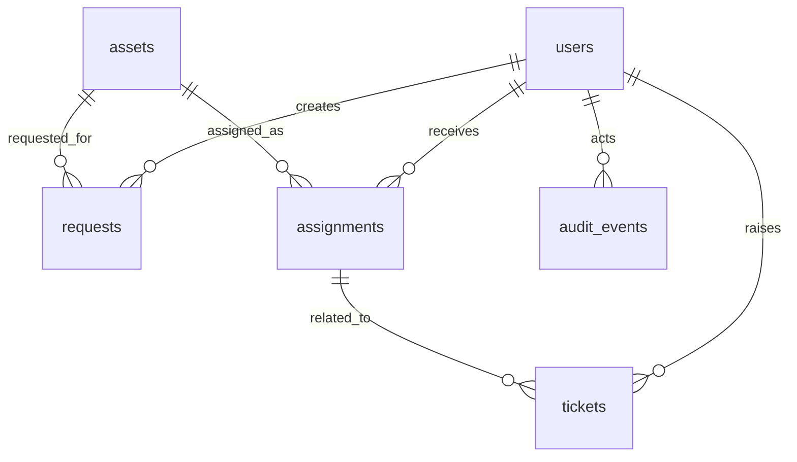

# Database Design

```mermaid
erDiagram
  users ||--o{ requests : creates
  users ||--o{ assignments : receives
  users ||--o{ tickets : raises
  assets ||--o{ requests : requested_for
  assets ||--o{ assignments : assigned_as
  assignments ||--o{ tickets : related_to
  users ||--o{ audit_events : acts
```
